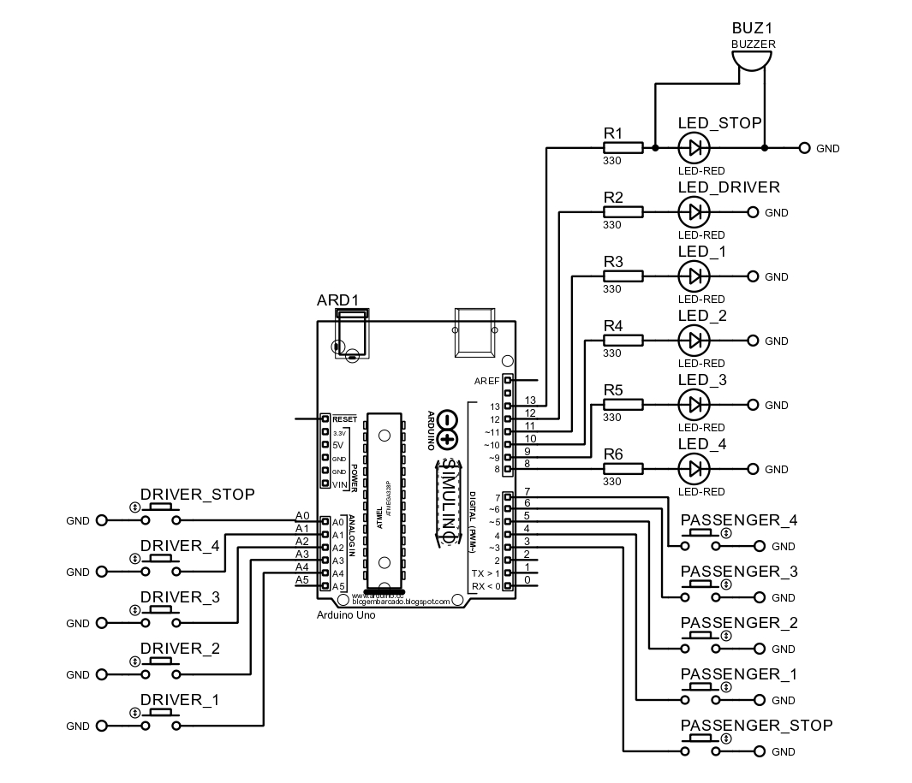

# Bus Stop Request System (Arduino - Multi Station)

This project is an Arduino-based **bus stop request system** designed for both **commuters and bus drivers**. It allows passengers to request stops and select stations, while the driver is notified through LEDs and indicators.

---

## Project Overview

The system supports:

- Passenger stop request  
- Station selection (1–4)  
- Driver acknowledgment  
- Visual alert system using LEDs  
- Blinking alert for stop request  

This improves:
- communication between passenger and driver  
- safety and awareness  
- efficiency in public transport  

---

## Features

### 🛑 Passenger Stop Request
- Passenger presses STOP button  
- System triggers blinking alert  

---

### 📍 Station Selection (1–4)
- Passenger selects destination station  
- LED indicator turns ON  

---

### 👨‍✈️ Driver Control Panel
- Driver sees which station is selected  
- Driver can reset system or confirm stop  

---

### 💡 LED Indicators

| LED | Purpose |
|-----|--------|
| LED_DRIVER | Driver alert |
| LED_STOP   | Stop blinking indicator |
| LED_1–4    | Station indicators |

---

### 🔁 Blinking Alert System
- STOP LED blinks 10 times  
- Driver LED also blinks when passenger pressed stop  

---

## System Workflow

### 1. Passenger Action
- Press STOP → triggers alert  
- Select station → LED turns ON  

---

### 2. Driver Notification
- STOP LED blinks  
- Driver LED blinks  

---

### 3. Driver Response
- Driver presses station button → turns OFF station  
- Or presses STOP → resets system  

---

### 4. Reset
- All LEDs turn OFF  
- System returns to idle  

---

## Pin Configuration

### 🔌 LEDs

| Component     | Arduino Pin |
|--------------|------------|
| Driver LED   | 12         |
| Stop LED     | 13         |
| Station 1 LED| 11         |
| Station 2 LED| 10         |
| Station 3 LED| 9          |
| Station 4 LED| 8          |

---

### 🔘 Passenger Buttons

| Component           | Arduino Pin |
|--------------------|------------|
| Stop Button        | 3          |
| Station 1 Button   | 4          |
| Station 2 Button   | 5          |
| Station 3 Button   | 6          |
| Station 4 Button   | 7          |

---

### 👨‍✈️ Driver Buttons

| Component           | Arduino Pin |
|--------------------|------------|
| Driver Stop        | A4         |
| Driver Station 1   | A3         |
| Driver Station 2   | A2         |
| Driver Station 3   | A1         |
| Driver Station 4   | A0         |

---

## Wiring Connections

### 🔘 Buttons (ALL Buttons)

All buttons use: INPUT_PULLUP

Connection:
- One side → Arduino pin  
- Other side → GND  

---

### 💡 LEDs

Each LED:
- Positive → Arduino pin  
- Negative → 220Ω resistor → GND  

---

## Hardware Components

- Arduino Uno / Mega  
- 10 Push Buttons (Passenger + Driver)  
- 6 LEDs  
- Resistors (220Ω)  
- Jumper wires  
- Power supply  

---

## Code Reference

📄 Source Code:  
:contentReference[oaicite:1]{index=1}  

---

## Notes

- Uses **Chrono library** for non-blocking timing  
- Buttons are active LOW (INPUT_PULLUP)  
- Blinking is controlled every 300ms  
- Station states are tracked using boolean variables  

---

## Limitations

- No sound/buzzer (LED only alert)  
- No wireless communication  
- Limited to 4 stations  
- No display interface  

---

## Summary

This project demonstrates a **multi-station bus stop request system** that combines:

- passenger input system  
- driver control panel  
- LED-based notification system  
- timed alert mechanism

It is suitable for:

- buses  
- jeepneys  
- shuttle services  
- transport automation prototypes

## Wiring Diagram

